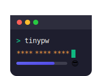

<p align="center">
  
</p>

# tinypw

 [](https://sonarcloud.io/summary/new_code?id=marconae_tinypw) [](https://sonarcloud.io/summary/new_code?id=marconae_tinypw)

A tiny, fast CLI tool to generate random passwords.

## Motivation

I wanted to learn Rust. Additionally, I often need to quickly generate passwords, and since I usually work in a
terminal, a CLI tool is highly convenient.

## Usage

Default behaviour:

```
> tinypw
Password: GLkuLb(RsK55Y(Y8
[███████████████░░░░░░░░░]  63.7% good 🙂
```

Set the length with `tinypw -l 20`:

```
> tinypw -l 20
Password: Fphb5nCbg6XZscn$5zD*
[██████████████████████░░]  90.8% strong 😎
```

Define the character set with `-m <mode>` where mode is a combination of letters:

- `u` = include uppercase `A–Z`
- `l` = include lowercase `a–z`
- `n` = include digits `0–9`
- `s` = include symbols `!#$&()*+/`
- `e` = exclude similar-looking characters: `i l 1 o 0 O`

Example: just lowercase letters and numbers:

```
> tinypw -l 20 -m ln
Password: hzdtx57jj2horb0x8dqh
[█████████████████████░░░]  86.8% strong 😎
```

Add extra characters with `-x <extra_chars>`.

Example: length 20, use uppercase, lowercase and numbers and also include `;:?!"'`

```
> tinypw -l 20 -m uln -x ";:?\!\"'"
Password: wlw7qp!9fEnataRS7ap:
[█████████████████████░░░]  86.8% strong 😎
```

Copy to clipboard with `-c`:

```
> tinypw -c
Password: HLCY2vvsanaQurdG
[████████████████░░░░░░░░]  67.7% strong 😎
Password copied to clipboard.
```

Quiet mode: print only the password with `-q`:

```
> tinypw -q
HLCY2vvsanaQurdG
```

## Planned for the future

- [x] Support for quiet mode and just return the password
- [ ] Generate multiple passwords with parameter `-n`

## Defaults

- Length: 16
- Mode: `ulnse` (upper, lower, numbers, symbols; exclude similar)
- Similar-looking characters excluded set: `il1o0O`
- Symbols used: `!#$&()*+/`

## Install

- With Rust installed: clone this repository and run `cargo build --release`.
- Optional: add to PATH: copy `target/release/tinypw` somewhere on your PATH.
- From source without a release profile: `cargo run --` followed by options shown below.

## How it works (brief)

- The CLI parses flags using the `clap` crate.
- It builds a base character set from your chosen mode, optionally excluding similar characters and adding extra chars.
- A password is generated by sampling uniformly at random from that base set for the chosen length using crate `rand`.

## License

- MIT. [See LICENSE](LICENSE).
